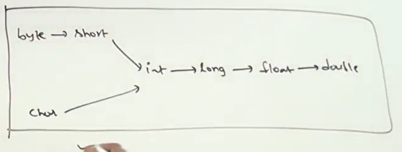
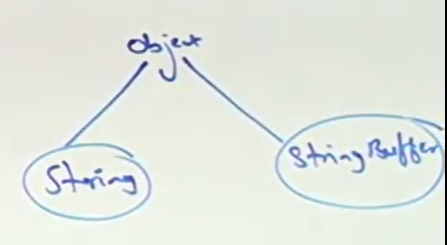
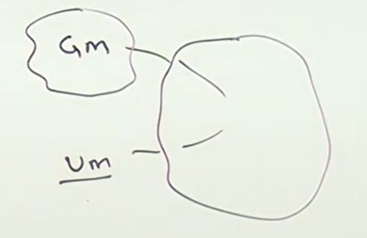
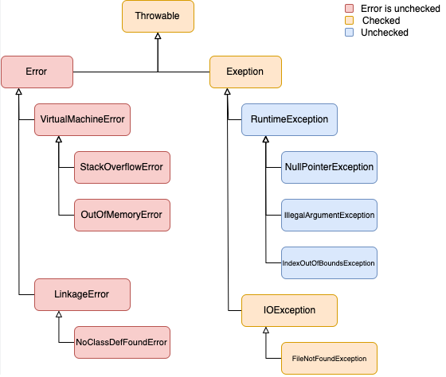
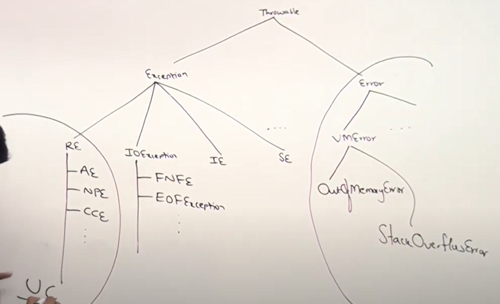

## Java Source File Structure

- we can have a number of java classes in java program.
- we can have `atmost one public class` in java program. otherwise we get compile time error.
- if we have public class `public class B`. compulsory the name of the java program will be `B.java`
- if there is no public class we can use any name for the java program.
- so like this is possible in a java program name `Durga.java`. because all classes are not public
```
class A{

}
class B{

}
class C{

}
```
- `javac Durga.java` will compile fine no syntactical mistake.
- if we add a public class whose name is different than java program. it give the following error.

````
class A{

}
public class B{

}
class C{

}
$ javac Durga.java
Durga.java:14: error: class B is public, should be declared in a file named B.java
public class B{
^       
1 error
````
- so if we save it as `B.java` it will happily compile.
- if we have 2 public classes in java application. it will also give the same above error.
- the class which contain main method has no relation with this to be the name of the java application

## class files

- for every class contain in a java application a separate `.class` file will be generated
````
  class A{

}
public class B{

}
class C{

}
````
- the above code will generate 3 `.class` files
- we can compile `.java` program but we can run `.class` file. important

## multiple classes with main method in a single java application

it is possible to have multiple classes with main method in a single java application.
````
class A{
    public static void main(String[] arg){
        System.out.println("A class main method");
    }
}

class B{
    public static void main(String[] arg){
        System.out.println("B class main method");
    }
}

class C{
    public static void main(String[] arg){
        System.out.println("C class main method");
    }
}

class D{
}
````
- if we execute class A its main method will be executed. if we execute B its main method will be executed.
- but if we execute class D as it has no main method it will give us error
- to execute a java class use command `java A`, `java B`, `java D` etc
````
$ java A
A class main method
````
````
$ java D
Error: Main method not found in class D, please define the main method as:
   public static void main(String[] args)                                 
or a JavaFX application class must extend javafx.application.Application 
````
## Import Statement Introduction

- let say we are instantiating objects from classes present in libraries like `ArrayList`.
- if we use it like below
````
public class ArrayListTest {
    public static void main(String[] args){
        ArrayList l = new ArrayList();
    }
}
````
it will give us the below error while compiling
````
$ javac ArrayListTest.java 
ArrayListTest.java:4: error: cannot find symbol
        ArrayList l = new ArrayList();
        ^
  symbol:   class ArrayList
  location: class ArrayListTest
````
so java don't know from where ArrayList classes is coming. for that we can either use fully
qualified name like
`java.util.ArrayList l = new java.util.ArrayList();`
or we can import it. so readability will improve and length of code will reduce. otherwise we have 
to use everywhere fully qualified names for classes
````
import java.util.ArrayList;
public class ArrayListTest {
    public static void main(String[] args){
        ArrayList l = new ArrayList();
    }
}
````
## Types of imports

### explicit imports
````
import com.sparkasse.loan;
import com.postbank.accout;
````
### implicit imports
````
import com.sparkasse.*
import com.postbank.*
import java.util.*
````
- implicit imports are not good because we don't know from where the class is coming.
- IDEs never generate implicit imports always explicit imports.
- highly recommended explicit imports.

## important points about imports

for 2 types of classes we don't need to import the package for it.

- first is `java.lang` package from where we are getting `String` for example. `Thread`, `Exception` and `StringBuffer`
are also from `java.lang`. we don't need import statement for it.
````
class A{
    public static void main(String[] arg){
        String s = new String("Durga");
        Thread t = new Thread();
        Exception e = new Exception();
        StringBuffer sb = new StringBuffer();
    }
}
````
- second is the `current working directory`. so classes defined in the same directory are not
imported it is the `default package`. it will import automatically
- if we want to use from outside package a compulsory import statement is required.
````
  public class Student {
    public static void m1(){
        System.out.println("Student class static method");
    }
}
````
````
public class Test{
    public static void main(String[] arg){
        String s = new String("Durga");
        Thread t = new Thread();
        Exception e = new Exception();
        StringBuffer sb = new StringBuffer();
//        no need import statement for Student class because it is from current working directory
        Student st = new Student();
        st.m1();
//        or
        Student.m1();
    }
}
````
- when we are importing a package all classes from that package will be imported but not the classes of sub packages.
- let us say we have `java->util->regex->Pattern`. so writing `import java.*` will import classes only in `java` package
not the classes of `java.util` or etc sub-packages.

## Java Source File Structure - Package Statement

- a group of related items or things is a package. so a group of related classes and interfaces are a package.
- for example `java.sql` package contain related classes for the sql database 
- package is an `encapsulation` mechanism to group related classes and interfaces together
- so if we have two same classes let say `Date`. we can use both in separate packages like `java.util.Date` and `java.sql.Date`
- so we can avoid naming conflicts
- and modularity of the application will improved by packaging
- maintainability of code will improve
- package is a wall. Outside package will not access inside class so security will also improve

## how to write, compile and run package statement

- use internet domain name in reverse for package naming to be unique
- when compiling if we write like `javac Test.java` the generated `Test.class` file will be place in `current working directory`
```
javac Test.java
current working directory
│       
│
└─── Test.class
|
```
````
package com.durgasoft.ocja;

public class Test{
    public static void main(String[] arg){
        System.out.println("package example");
    }
}
````
- now if we have a package for example `com.durgasoft.ocja` and we want to compile
the `Test.java` program in the path of this package we use this command
`javac -d . Test.java`. This `Test.class` will be created in `com.durgasoft.ocja.Test.class`
- `.` means `current working directory`. if `com`, `durgasoft`,`ocja` will not be there so automatically it will be created
- if we write `javac -d E: Test.java`. The `Test.class` file will be created in path `E:` destination.
- if we want to run this class we need to give the fully qualified name like `java com.durgasoft.ocja.Test`
````
$ java com.durgasoft.ocja.Test
package example
````
## important point about package statement

1) atmost one package is allowed in a java program if we provide more than one package compile will give error
````
package pack1;
package pack2;

public class Test{
}
````
if we compile the above program using `javac -d . Test.java` it give below error
````
$ javac -d . Test.java
Test.java:24: error: class, interface, or enum expected
package pack2;                                         
^                                                      
1 error
````
2) first non-commented line must be package. declaring package after imports is not allowed.
````
import java.util.*
package pack1;

public class Test{
}
````
the above thing will give error.
````
$ javac -d . Test.java
Test.java:24: error: class, interface, or enum expected
package pack2;                                         
^                                                      
1 error
````
the order is important and will be like this.
```
package statement
│       
└─── import statement
│   
└─── class/interface/enums
```
## class level modifiers: public and default

we have to provide information to the JVM about the behaviour of the class. for that we use `modifiers`. To let the program
know that this class is accessable from anywhere or not. 

- if class is `public` we can access it in any package. this package or any other package.
- if no modifier is used the class is `default` and only accessable in current package. not to the outside
- if class is `abstract` object creation is not possible
- if class is not `abstract` object can be created happily
- if the class is `final` than the child class creation is not possible
- if class is not `final` child classes can be created happily.

### what are allowed modifiers for top level classes?

the only applicable modifiers for top level classes are `public`,`default means nothing`, `abstract`,`final` and `strictfp`


### what are allowed modifiers for inner classes?

- the applicable modifiers for inner classes are 8 `public`,`default means nothing`, `abstract`,`final`, `private`,`protected`,`static` and `strictfp`
- `private`,`protected`,`static` are only allowed for inner classes.

## Abstract Method

`abstract` modifier is the most important modifier. where we can use `abstract` modifier?

1. with methods possible
2. with classes possible
3. with variables `abstract` modifier is not possible.

abstract in general mean partial, not completed something like this.

### important point about Abstract Method

1. `abstract methods` will have only declaration and not implementation.
2. `abstract methods` has no body or you can say no curly braces.
3. `abstract methods` ends  with a semicolon `;` and have no implementation
4. The class containing the `abstract mehod` must also be declared as `abstract` otherwise error
5. `abstract methods` will be implemented by the `child classes`

we will discuss these points with some examples. The below example is correct and will compile correctly
````
public abstract class abstract_method {
    public abstract int getNoOfWheels();
    public abstract String getTaste();
    public abstract double getLoanInterest();
}
````
as we can see in all the 3 cases we don't know the return value that is the reason we declared it as `abstract methods`.
it means no of wheels, fruit taste and interest loan can be different not a single value. which we will implement in the child classes.

Below we present some scenario and determine if it is a valid syntax or not.

````
public abstract void m1(){}   // not valid as we have curly braces
public void m1();             // not valid because not abstract still we don't have implementation we need {}
public abstract void m1();    // valid
public void m1(){}            // valid
````
## abstract class

abstract class means incomplete class. if a class start with `abstract` modifier are `abstract class`. some important points about it are below.

1. if a class contain atleast one `abstract method` the class must be declared as `abstract` otherwise compiler error
2. even though if we don't have `abstract methods` we can declare a class as abstract if the methods declared are dummy or incomplelte.
3. we cannot create `object` of abstract classes.
4. in other words we cannot instantiate it. because of the reason that these classes are incomplete.

we cannot instantiate because if we do it and try to access an `abstract method` it will give error because it has no implementation.
or if we have dummy methods we cannot get anything.

abstract class with abstract method
````
abstract public class abstract_class {
    public abstract int getNoOfWheels();
}
````
abstract class with dummy methods
````
abstract public class abstract_class {
    public void m1(){}
    public void m2(){}
    public void m3(){}
}
````
- in future we will see every `Adapter class` is an abstract class
- also the `httpservlet classes` are abstract classes. which even doesn't contain abstract methods.

## abstract class vs abstract method

let say we have an abstract class
````
abstract class Test{
    public abstract void m1();
    public abstract void m2();
}
````
to implement these abstract methods we need a child class for example
````
public class SubTest extends Test{
    public void m1(){}
}
````
to make a child class we have to use the `extends` keyword as above. and you observe we have implemented the
method `m1(){}` in child class `SubTest` but compiler will give error. why because we implement only one method
from the parent class we have to implement all the methods from parent class in the child class.

so the possible fixes are 2

1. provide implementation for all the abstract methods in the child classes.
2. if we are going to provide implementation for only one method than declare the child class also `abstract`. because
it is not complete.

we will provide a real life example here
````
abstract class vehicle{
    public abstract int getNoOfWheels();
}

class bus extends vehicle{
    public int getNoOfWheels(){
        return 6;
    }
}

class Auto extends vehicle{
    public int getNoOfWheels(){
        return 3;
    }
}

public class child_classes {
    public static void main(String[] args){
        bus b = new bus();
        Auto a = new Auto();
        System.out.println(b.getNoOfWheels());  // 6
        System.out.println(a.getNoOfWheels());  // 3
    }
}
````
The question is why are we giving abstract methods in the parent. even without this the code will run. this is because
if we want to force the user to create classes for which it is necessary.

## Member Modifiers: public, default and private

member means it may be a `variable` or may be a `method`. member modifiers are 12 but we will discuss only 4 here.

### public modifier

- if a member is declared as `public` we can access it from anywhere inside a package or outside
- but where ever the public member is declared the enclosed class must also be `public` if class is not public than we cannot access it.

### default modifier

if there is no modifier that member is default.
- default member are only accessable within the same package. outside the package it is not possible.
- even though the enclosing class is public but if the member i.e variable or method is default we cannot access it from outside the package

### private members

private members are only accessable within the same class.

- private -- class level
- default -- package level
- public -- global level

1. recommended modifiers for data members `variable` is always `private`. 
2. recommended modifiers for methods is `public`

## Member modifiers as protected

if a member is declared as `protected` it means that it is accessable inside the package plus   the child classes outside of the package.

````
protected = <default> + kids
````
### how we know a child class

the class which is extended from another class is a child class.
````
class B extends A
````
here B is a child of class A.

````
package com.protectedmembers;

class A {
    protected void m1(){
        System.out.println("A class protected methods");
    }
}

class B extends A {
    public static void main(String [] args){
        A a = new A();
        a.m1(); // valid parent reference parent object

        B b = new B();
        b.m1(); // valid child reference child object

        A a1 = new B();
        a1.m1(); // valid parent reference child object
    }
}
````
within the same package we can use any reference either parent reference or child reference.
first compile `javac -d . protected_members.java`
then run using `java com.protectedmembers.B`

````
$ java com.protectedmembers.B
A class protected methods
A class protected methods
A class protected methods
````
### important about protected

- if we are accessing the protected members in the same package we can access it either with parent class reference or child class reference no problem.
- but if we are accessing the protected members in a different package with a child class we can access it only with the `child class reference` not with the `parent class reference`.

````
package pack1;

public class A {
    protected void m1(){
        System.out.println("A class protected methods");
    }
}
````
````
package com.pack2;
import pack1.A

public class B extends A {
    public static void main(String [] args){
        A a = new A();
        a.m1(); // not valid because different package and parent reference

        B b = new B();
        b.m1(); // valid even different package child class but reference is child class

        A a1 = new B();
        a1.m1(); // not valid because reference is a parent class
    }
}
````
````
$ javac -d . packs/pack2/B.java
packs\pack2\B.java:8: error: m1() has protected access in A
        a.m1();
         ^
packs\pack2\B.java:14: error: m1() has protected access in A
        a1.m1();
          ^
2 errors
````

## Summary of public, protected, default and private modifiers

| Visibility                                    | public | protected                                 | default | private | 
|-----------------------------------------------|--------|------------------------------------------ | ------- |-------- |
| within the same class                         |  yes   |  yes                                      |  yes    |  yes    |
| from child class of same package              |  yes   |  yes                                      |  yes    |  no     |
| from non-child class of same package          |  yes   |  yes                                      |  yes    |  no     |
| from child class of different package         |  yes   |  yes [we sholud use child reference only] |  no     |  no     |
| from non-child class of outside package       |  yes   |  no                                       |  no     |  no     |

`privat < default < protected < public` is the ascending order of restriction.

## interface Declaration and implementation

interface is defined by using `interface` keyword.
- class is responsible for implementation of `interface`. to implement class use the keyword `implements`.
- by default all the methods in `interface` are `public` and `abstract`. if we declare it or not all of it are `public` and `abstract`

### important point for implementation of interface in a service provider class

1. The class must declare the method of `interface` as public while implementing it otherwise error.
2. All the methods of the `interface` must need to be implemented otherwise error.
3. if we want implement some of the method of the interface than we have to declare the service provider class as `abstract` because it is not giving the implementation for all the methods
4. we can use the child class of service provider class to implement the remaining methods.

````
interface Interf{
    void m1(); // by default these are `public abstract`
    void m2(); // by default these are `public abstract` if we write or not
}

public class ServiceProvider implements Interf{

    public void m1() {

    }


    public void m2() {

    }
}
````
The above code will work fine. if implement only 1 method than we can also do like this.
````
interface Interf{
    void m1(); // by default these are `public abstract`
    void m2(); // by default these are `public abstract` if we write or not
}

abstract public class ServiceProvider implements Interf{

    public void m1() {

    }

}
````
and to implement the second method we can use child classes
````
interface Interf{
    void m1(); // by default these are `public abstract`
    void m2(); // by default these are `public abstract` if we write or not
}

abstract public class ServiceProvider implements Interf{

    public void m1() {
        System.out.println("method m1");
    }

}

class SubServiceProvider extends ServiceProvider{
    @Override
    public void m2() {
        System.out.println("method m2");
    }
}
````
## Data Hiding

It means outside person should not access out internal data directly. we have to hide it. example of gmail inbox was giving. without my data validation that is email and password is not possible.
for this we declare the variable as `private` and then if we need data we use `getMethods`

````
public class Account{
    private double balance;

    public double getBalance(){
        // validation
        if(validation is correct){
        return balance
        }
    }
````
## Abstraction

we are providing the following services. but how these services are implemented is hided this is called `Abstraction`. so hiding of implementation is `Abstraction`. This is done for security reasons.
`interfaces` are used to implement `Abstraction`.

### importance

1. Security
2. Enhancement
3. maintainability will improved
4. Modularity will improved

## Encapsulation

The process of grouping the `data members` and the `methods` together is called `encapsulation`. `class` is an example of `encapsulation`.

`Encapsulation = Data hiding + Abstraction`

- `getter` and `setter` are used for validation.

Hiding data behind methods is infact `Encapsulation`

### importance

1. Security
2. Enhancement
3. maintainability will improved
4. Modularity will improved

## Tightly Encapsulated Class

a class is `Tightly Encapsulated Class` if and only if all the variables inside it are `private`.

- if parent class in not Tightly encapsulated than no child class is tightly encapsulated.

## Inheritance Introduction

1. inheritance is relationship
2. for code reuseability
3. `extends` keyword is used for relationship

This child classes which will be build using `extends` keyword contain all the methods of its parent class by default 
because it is inherited from it.

parent reference can be used to hold the child object. but we cannot use it to access the child methods
````
class P {
    public void m1(){
        System.out.println("parent");
    }
}

class C extends P{
    public void m2(){
        System.out.println("child");
    }
}

class Testt {
    public static void main(String[] args){
        P p = new P();
        p.m1();
//        p.m2(); cannot access child methods

        C c = new C();
        c.m1();
        c.m2(); // we can call both parent and child methods

        P p1 = new C();
        p1.m1();
//        p1.m2(); parent reference can be used to hold the child object. but we cannot use it to access the child methods
    }
}

````
Parent reference can be used to hold the child Object but child reference cannot be used to hold the parent object.
````
C c1 = new P(); // Parent reference can be used to hold the child Object but child reference cannot be used to hold the parent object.
````
## Importance of Inheritance

The importance that the classes will get reduced we will not need to write classes again in child classes.
- which class is the root of all the classes ---> `Object Class`
- `Object Class` contains the most common methods for all Java classes.

## Types of Inheritance

### Single inheritance

`Class B extends A` it is possible in Java

### multiple inheritance

multiple inheritance is not possible in Java

`Class C extends A,B` is not possible

### multi-level inheritance

this is possible in Java.

`Class A`
`Class B extends A`
`Class C extends B`

### hierarchial inheritance

it is supported. it means if from one class many classes inherit separately
`Class A`
`Class B extends A`
`Class C extend A`
`Class D extends A`

## Multiple Inheritance

Java provide supports for `multiple inheritance` only in `interface` but not classes. because interfaces are not implementing the classes.
so 
````
interface P1{}
interface P2{}
interface C extends P1,P2
````
is perfectly fine.

- in java 1.8 and onwards we can use `default methods` in interfaces but still multiple inheritance will not make any problem.

if interviewer ask that if every class is the child of `Object` class and the we are extending some classes also. so how is
multiple inheritance not possible in java.

The answer is that when we have simple class i.e `class A` so it is extending from `Object class`. if we have `class B extends A`
than it is extending not from `Object` class but from the `Class A` and then class A is extending Object class.

## Cyclic Inheritance

it is not supported in java.

`class A extends A`  --- not possible
````
class A extends B
class B extends A
````
this also not possible

## Method Signature

what is `method signature` ? 
method signature contains the following
1. Method Name
2. Method arguments types
3. Order of arguments must be same
4. the name of arguments can be different but type must be same

if we have a method let say
`public int m1(int i, float f)`

its method signature is `m1(int, float)`

- in C++ return type is also the part of method signature but in java return type is not.

compiler is using `method signature` to resolve `method calls`.

compiler will maintain a `Method Table` for every class.
if a method signature is not there in a method table for a class and we are trying to call it.
it will give compile time error. suppose we are calling a method with a double value and it is not
present the error message will be.

`cannot find symbol, method m3(double)`

### important

- 2 methods with the same signature is not acceptable in a class.
````
class Test{
public void m1(int i){}   // signature m1(int)
public int m1(int j){return 10}  // signature m1(int)
}
````
the error we get by compiler is.
`method m1 is already defined`

## Overloading Introduction

when methods names are same and arguments are different is called `overloading`.
In C `method overloading` is not available. so there 2 methods with same name is not possible. in C
````
abs(int) // for int data type
labs(long) // for long data type
fabs(float) // for float data type
````
In java we can use same `abs` method for different argument type.
````
abs(int)
abs(long)
abs(float)
````
code complexity decreases in java.

### important

suppose `Test t = new Test()`
here `Test t` is the `reference type`.

in overloading `method resolution` is always taken care by the compiler based on `reference type` but not based on `runtime object`.
that is why `overloading` is also known as `compile time polymorphism` or `static polymorphism` or `early binding`

## Method Overloading case study - 1

````
class Testtt {
    public void m1(int i){
        System.out.println("int-arg method");
    }
    public void m1(float f){
        System.out.println("float-arg method");
    }
    public static void main(String[] args){
        Testtt t = new Testtt();
        t.m1(10);
        t.m1(10.5f);
        t.m1('a'); // automatic promotion to int
        t.m1(10l); // automatic promotion to float
        t.m1(10.5); // it is double and we don't have and can't be promoted so compiler error
    }
}
````
the output will be
````
$ java Testtt
int-arg method
float-arg method
int-arg method
float-arg method
````
so if you notice the one with character `t.m1('a')` is promoted to int which is the next higher type. This is called `automatic
promotion`. here is chart for it.



so the compiler will not give error immediately. first it will promote the argument to the next level. if there is some type it will use that.

## Method Overloading case study - 2

in case we have overloaded methods of `Object` and `String`
````
class Testttt {
    public void m1(Object o){
        System.out.println("object version");
    }
    public void m1(String s){
        System.out.println("String version");
    }
    public static void main(String[] args){
        Testttt t = new Testttt();
        t.m1(new Object()); // Object version will call
        t.m1("Aamir");      // String version
        t.m1(null);         // null is both String and Object but String will be called
    }
}
````
output is
````
$ java Testttt
object version
String version
String version
````
as you can see `null` can be both `String` and `Object` in such case where we have overloaded methods of both `parent` and `child`
than `child` method will be get called. here `String` is the child of `Object`.

if in case `child` is not present `parent` method will be executed.

## Method Overloading case study - 3

In this case if we have same level child from let say `Object`. than while overloading a `null` value will give error.
because compiler is confuse. `Ambigous method call`



````
class Testtttt {
    public void m1(String s){
        System.out.println("String version");
    }
    public void m1(StringBuffer sb){
        System.out.println("StringBuffer version");
    }
    public static void main(String[] args){
        Testtttt t = new Testtttt();
        t.m1("Aamir"); // String version
        t.m1(new StringBuffer("Aamir")); // StringBuffer version
//        t.m1(null); // will give compiler error because String and StringBuffer are same level child from Object
    }
}
````
## Method Overloading case study - 4

- `m1(int... i)` here `int...` means we can take any number of int values or zero int values. This concept is in new java 1.8
- so here if we have conflict between `General method` and `Var-arg method` the `General method` will win. for all other situation `Var-arg` methods will execute.


````
class Testttttt {
    public void m1(int i){
        System.out.println("General method");
    }
    public void m1(int... i){
        System.out.println("Var-arg method");
    }
    public static void main(String[] args){
        Testttttt t = new Testttttt();
        t.m1(); // Var-arg method
        t.m1(2,3); // Var-arg method
        t.m1(10); // General method
    }
}
````
output is 
````
Var-arg method
Var-arg method
General method
````
## Method Overloading case study - 5

so if we have method overloading where we have 2 arguments one is int and one float. we have to give exact
argument type when calling the methods. here `automatic type promotion` will not work.
example of india and pakistan.
````
class Testtttttt {
    public void m1(int i, float f){
        System.out.println("int and float argument types");
    }
    public void m1(float f, int i){
        System.out.println("float and int argument types");
    }
    public static void main(String[] args){
        Testtttttt t = new Testtttttt();
        t.m1(10, 10.5f); // int and float argument types
        t.m1(11.5f, 5); // float and int argument types
      //  t.m1(6,6); //Ambiguous method call. Both
      //  t.m1(6.6f,6.6f); // Cannot resolve method 'm1(float, float)'
    }
}
````
if we run the first 2 methods the output will be
````
$ java Testtttttt
int and float argument types
float and int argument types
````
## Method Overloading case study - 6

The resolution of methods calling is done by compiler which is based on `reference type`. this is important
point. we will present an example for this.

````
class Animal{

}
class Monkey extends Animal{

}

class Testttttttt {
    public void m1(Animal a){
        System.out.println("Animal version");
    }
    public void m1(Monkey m){
        System.out.println("Monkey version");
    }
    public static void main(String[] args){
        Testttttttt t = new Testttttttt();

        Animal a = new Animal();
        t.m1(a); // Animal verion

        Monkey m = new Monkey();
        t.m1(m); // Monkey version
    }
}
````
the output will be
````
$ java Testttttttt
Animal version
Monkey version
````
uptill here it is fine, but if use `reference type` of parent i.e `Animal` and create an object of child class
i.e `Monkey` and then we call `m1()` what will happen??

````
class Animal{

}
class Monkey extends Animal{

}

class Testttttttt {
    public void m1(Animal a){
        System.out.println("Animal version");
    }
    public void m1(Monkey m){
        System.out.println("Monkey version");
    }
    public static void main(String[] args){
        Testttttttt t = new Testttttttt();

        Animal a = new Animal();
        t.m1(a); // Animal verion

        Monkey m = new Monkey();
        t.m1(m); // Monkey version

        Animal a1 = new Monkey();
        t.m1(a1); // Animal version
    }
}
````
the ouput will be
````
$ java Testttttttt
Animal version
Monkey version
Animal version
````
so as you see it depends on the `reference type` not on the `created object`.

## Method Overriding

`method overriding` is a process in which the child class `override` the parent class methods. example of `Rabia` and `Katrina`.
the child can add extra things to the overriden method.

`method overriding` is also called as `runtime polymorphism`, `dynamic polymorphism` or `late binding`.
we will give an example here.

````
class Parent{
    public void property(){
        System.out.println("cash, land, gold");
    }
    public void marry(){
        System.out.println("Rabia");
    }
}
class Child extends Parent{
    @Override
    public void marry() {
        System.out.println("Katarina");
    }
}
class MethodOverriding {
    public static void main(String[] arg){
       Parent p = new Parent();
       p.marry(); // Rabia

       Child c = new Child();
       c.marry(); // Katarina

       Parent p1 = new Child();
       p1.marry(); // Katarina, so here it depends on runtime Object creation, even though reference type is parent
        // child class overriden method is executed.
    }
}
````
At runtime JVM is always going to check which is the runtime Object created. so it will give chance to the child class here.
means that in `overridding` method resolution takes care by the JVM. based on `runtime object` which is on the right `new Child()` and `new Parent()`.

That is why overriding is `runtime polymorphism`, `dynamic polymorphism` or `late binding`

## Method Overriding Rules Part - 1

it is not an easy process we have to take care of many things.

1. until java 1.4 version for `overriding methods` the signature i.e `method name`, `argument type` and `return type` must be same.
2. from java version 1.5 for `overriding methods` the signature i.e `method name`, `argument type` must be same and for the `return type` `co-variant`
is possible. `co-variant` means `return type` of the `child method` possibly can be the `child` of the `parent method` return type.

in the below example we will see.
````
class ParentMethodOverriding {
    public Object m1(){
        System.out.println("Parent method return type Object");
        return null;
    }
}

class ChildMethodOverriding extends ParentMethodOverriding{
    public String m1(){
        System.out.println("Child method return type String");
        return null;
    }
}
class MethodOverridingRulesPart1 {
    public static void main(String [] args) {
        ParentMethodOverriding p = new ParentMethodOverriding();
        p.m1(); // Parent method return type Object

        ChildMethodOverriding c = new ChildMethodOverriding();
        c.m1(); // Child method return type String
    }
}
````
so in above program the `return type` of parent class method is `Object` and `return type` of child class overriden method
is `String` which is allowed after java version 1.5.

but if we make it opposite i.e. `parent method return type ---- String` and `child method return type ---- Object`. it 
will give error
````
class ParentMethodOverriding {
    public String m1(){
        System.out.println("Parent method return type Object");
        return null;
    }
}

class ChildMethodOverriding extends ParentMethodOverriding{
    public Object m1(){
        System.out.println("Child method return type String");
        return null;
    }
}
class MethodOverridingRulesPart1 {
    public static void main(String [] args) {
        ParentMethodOverriding p = new ParentMethodOverriding();
        p.m1(); 

        ChildMethodOverriding c = new ChildMethodOverriding();
        c.m1(); 
    }
}
````
and the error will be
`'m1()' in 'ChildMethodOverriding' clashes with 'm1()' in 'ParentMethodOverriding'; attempting to use incompatible return type`

### possible not possible

1. (parent method return type) Object ---> (child method return type) String, StringBuffer, Object (possible)
2. (parent method return type) Number ---> (child method return type) Long, Float, Double, Short, Byte wrapper classes (possible)
3. (parent method return type) String ---> (child method return type) Object (not possible)
4. (parent method return type) double ---> (child method return type) int (not possible because this `co-variant` only works with Object not primitive types)

### compiling with lower version

`javac -source 1.4 method_overriding_rules_part1.java`. so with this `co-variant` thing will not work.

also for the primitive type example
````
class ParentMethodOverriding {
    public double m1(){
        System.out.println("Parent method return type double");
        return 10.5;
    }
}

class ChildMethodOverriding extends ParentMethodOverriding{
    public int m1(){
        System.out.println("Child method return type int");
        return 5;
    }
}
class MethodOverridingRulesPart1 {
    public static void main(String [] args) {
        ParentMethodOverriding p = new ParentMethodOverriding();
        p.m1(); // Parent method return type Object

        ChildMethodOverriding c = new ChildMethodOverriding();
        c.m1(); // Child method return type String
    }
}
````
This will give the error `'m1()' in 'ChildMethodOverriding' clashes with 'm1()' in 'ParentMethodOverriding'; attempting to use incompatible return type`

## Method overriding rules part - 2

here we will discuss method overriding with other modifiers such as `private`, `final` etc

### for private method return type

as the `private methods` in parent are not visible to the child classes so no need to worry about overriding.
overriding concept is not applicable to the private members of the parent class. for example
````
class PP {
    private void m1(){
        
    }
}

class CC extends PP {
    private void m1(){
        
    }
}
````
this is perfectly valid but it is not overriding.

### for final method return type

if we declare a method return type in parent as `final` then we cannot override it in childe otherwise we got error.

````
class PP {
    public final void m1(){

    }
}

class CC extends PP {
    public void m1(){

    }
}
````
we get the below error
````
'm1()' cannot override 'm1()' in 'PP'; overridden method is final
````
and if we declare the child method return type also `final` still we get the error.
````
class PP {
    public final void m1(){

    }
}

class CC extends PP {
    public final void m1(){

    }
}
````
````
'm1()' cannot override 'm1()' in 'PP'; overridden method is final
````
- if parent is `non-final` and child is `final` it is acceptable. it will compile
````
class PP {
    public void m1(){

    }
}

class CC extends PP {
    public final void m1(){

    }
}
````
### for abstract method return type

1. if the parent class has a method whose return type is `abstract` than it means it has no implementation. so in child class
we can use `non-abstract` return type method to implement the method. it is normal
2. is it possible in parent class `non-abstract` return type method and then we have overrided method in child class
which is `abstract`. yes it is also possible. then the child of this child mean `subChild` can implement the child method.
This is used to hide the implementation of `parent` from the `subchild`. This is also possible.

### miscellaneous return types

1. `synchronized` -- to -- `non-synchronized` and `non-synchronized` --  to -- `synchronized` overriding is possible
2. `native` -- to -- `non-native` and `non-native` --  to -- `native` overriding is possible
3. `strictfp` -- to -- `non-strictfp` and `non-strictfp` --  to -- `strictfp` overriding is possible

so if you observe only `final` return type modifier we cannot override.

## Method overriding rule part - 3

- while overriding we cannot reduce the scope of modifier for example from `public` to `protected`.
- but in overriding we can increase the scope of modifier for example from `protected` to `public` is possible.

in coding example below
````
class PPP{
    public void m1(){
        
    }
}
 class CCC extends PPP{
    protected void m1(){
        
    }
 }
````
we get this error because while overriding we decreased the scope
````
'm1()' in 'CCC' clashes with 'm1()' in 'PPP'; attempting to assign weaker access privileges ('protected'); was 'public'
````
and the below example will work perfectly fine because the scope is increased.
````
class PPP{
    protected void m1(){
        
    }
}
 class CCC extends PPP{
    public void m1(){
        
    }
 }
````
`private<default<protected<public`

1. `public` to `public` allowed
2. `protected` to `protected` and `public` allowe
3. `default` to `default`, `protected` and `public` allowed
4. for private overriding is not applicable

## Method Overriding Rules Part - 4

so we have two types of `Exceptions`
1. checked Exception
2. unchecked Exception



A checked exception is caught at compile time whereas a runtime or unchecked exception is, as it states, at runtime.
A checked exception must be handled either by re-throwing or with a try catch block, whereas an unchecked isn't required to be handled.




`Runtime exception` and its child classes and `Error` and its child classes are `unchecked exceptions`

`RE -- runtime exception`
`AE -- Arithmatic exception`
`NPE -- Null Pointer exception`
`CCE -- Class cached exception`
`IE -- interrupt exception`
`SE -- Servlet exception`
`FNFE -- File not found exception`

so while overriding what we have to do about `Exceptions`? there is a simple rule.

### rule

if child class method throws any `checked exception` compulsory parent class method should throw the same
`checked exception` or its parent.

for `unchecked exception` we have no rule. we can use anywhere.

````
1.  P: public void m1() throws Exception
    C: public void m1()     // valid because child is not throwing any exception

2.  P: public void m1()
    C: public void m1() throws Exception // invalid. here parent is not throwing checked Exception so compiler give error
    // so to solve this parent method also throw Exception or its parent i.e. Throwable

3.  P: public void m1() throws Exception  // valid because IOException is child of Exception
    C: public void m1() throws IOException

4.  P: public void m1() throws IOException // invalid
    C: public void m1() throws Exception

5.  P: public void m1() throws IOException // valid because these are childs
    C: public void m1() throws EndOfFileException, FileNotFoundException

6.  P: public void m1() throws IOException // invalid, InterruptException not child of IOException
    C: public void m1() EndOfFileException, InterruptException

7.  P: public void m1() throws IOException
    C: public void m1() EOFException, NPE // valid, NPE is unchecked no problem

8.  P: public void m1() throws IOException
    C: public void m1() AE, NPE // valid, both are unchecked no problem
````
## Method Hiding

### Overriding with respect to Static methods

Static Methods: These methods are class level
instance Methods: is related to object level.

so if want to override the `class level` methods i.e `static methods` with `object level` instance methods.
in simple words `static` to `non static` and from `non static` to `static` overriding is not possible. it will
give errors.

### static to non static
````
class PPPP{
    public static void m1(){
        
    }
}
 class CCCC extends PPPP{
    public void m1(){
        // Error: Instance method 'm1()' in 'CCCC' cannot override static method 'm1()' in 'PPPP'
        
    }
 }
````
### non static to static
````
class PPPP{
    public  void m1(){

    }
}
class CCCC extends PPPP{
    public static void m1(){
        // Error: Static method 'm1()' in 'CCCC' cannot override instance method 'm1()' in 'PPPP'

    }
}
````
### static to static

it will work, but it is not `overriding` it is `method hiding`
````
// Method hiding
class PPPP{
    public static void m1(){

    }
}
class CCCC extends PPPP{
    public static void m1(){
       

    }
}
````
### method overriding
````
// Method overring
class PPPP{
    public  void m1(){
    }
}
class CCCC extends PPPP{
    public  void m1(){
    }
}
````
### important

- in `method overriding` means when both the parent and child methods are not `static` method resolution is always taken care by the `runtime JVM object`
````
class PPPP{
    public  void m1(){
        System.out.println("parent");
    }
}
class CCCC extends PPPP{
    public  void m1(){
        System.out.println("child");
    }
}

class Teste{
    public static void main(String [] arg){
        PPPP p = new PPPP();
        p.m1(); // parent

        CCCC c = new CCCC();
        c.m1(); // child

        PPPP p1 = new CCCC();
        p1.m1(); // child so it depends on the JVM object on the right

    }
}
````
- in `method hiding` means when both the parent and child methods are `static` method resolution is always taken care by the compiler based on `reference type` not on the `runtime object`
````
class PPPP{
    public static void m1(){
        System.out.println("parent");
    }
}
class CCCC extends PPPP{
    public static void m1(){
        System.out.println("child");
    }
}

class Teste{
    public static void main(String [] arg){
        PPPP p = new PPPP();
        p.m1(); // parent

        CCCC c = new CCCC();
        c.m1(); // child

        PPPP p1 = new CCCC();
        p1.m1(); // parent so it depends on the reference type on the left

    }
}
````
### difference between method hiding and method overriding

| Method Hiding                                                               | Method Overriding                                                      |
|-----------------------------------------------------------------------------|------------------------------------------------------------------------|
| 1. Both parent class and child class methods should be static.              | 1. Both parent class and child class methods should be non-static.     |
| 2. Method resolution always takes care by compiler based on reference type. | 2. Method resolution always takes care by JVM based on runtime object. |
| 3. Method hiding is compile time polymorphism or static polymorphism or early binding. | 3. Overriding is runtime polymorphism, dynamic polymorphism, or late binding | 

## Overriding w.r.t var-arg methods

so let say in parent class method we have `var-arg` arguments while in child class we have one int argument like below.
````
class PPPPP {
    public void m1(int... i){
        System.out.println("parent");
    }
}

class CCCCC extends PPPPP{
    public void m1(int i){
        System.out.println("child");
    }
}

class Testee{
    public static void main (String [] arg){
        PPPPP p = new PPPPP();
        p.m1(10); // parent

        CCCCC c = new CCCCC();
        c.m1(10); // child

        PPPPP p1 = new CCCCC();
        p1.m1(10); // parent, based on compiler reference type in overloading
    }
}
````
so this is not `overriding` but actually it is `overloading` because the argument in both parent and child are not the same. 
so in overloading we know that the method resolution will be based on the `compile reference type` i.e parent on the left.

output
````
$ java Testee                                                                                     
parent
child
parent
````
### conclusion

so `var-arg` method cannot be overrided with the simple methods. if we want to override the `var-arg` method in parent. the 
child methods must also be `var-arg`. like below

````
// var-arg to var-arg overriding
class PPPPP {
    public void m1(int... i){
        System.out.println("parent");
    }
}

class CCCCC extends PPPPP{
    public void m1(int... i){
        System.out.println("child");
    }
}

class Testee{
    public static void main (String [] arg){
        PPPPP p = new PPPPP();
        p.m1(10); // parent

        CCCCC c = new CCCCC();
        c.m1(10); // child

        PPPPP p1 = new CCCCC();
        p1.m1(10); // child, based on the JVM runtime object.
    }
}
````

